# **InvoicEasy**

# Overview
InvoicEasy is to be a simple online invoicing tool which allows small businesses to quickly and easily set up customer accounts and produce PDF invoices.  Inspired by the major accounting packages, but recognising the needs of the microbusiness first.

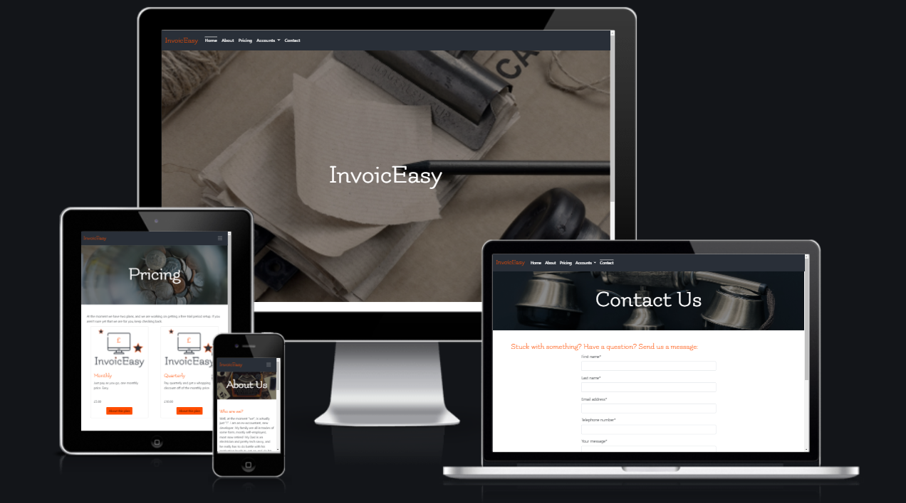

# Index
1. [UX](#ux)
    * [User Stories](#user-stories)
    * [Strategy](#strategy)
    * [Scope](#scope)
    * [Structure](#structure)
    * [Skeleton](#skeleton)
    * [Surface](#surface)
1. [Features](#features)
    * [Existing Features](#existing-features)
    * [Features for Future Implementation](#features-for-future-implementation)
1. [Testing](#testing)
1. [Development Life Cycle](#development-life-cycle)
1. [Deployment of the Application](#deployment)
    * [Cloning via GitPod](#cloning-a-project-into-gitpod)
    * [Cloning Locally](#how-to-run-the-code-locally)
1. [Technologies Used](#technologies-used)
1. [Credits](#credits)
    * [Website](#website-credits)
    * [README](#readme-credits)

Note, testing information can be found in a separate document:
* [Testing](TESTING.md)

## UX

### **Overview and Broad Design Choices**
The premise of InvoicEasy is to allow small businesses of all types to make use of a simple system.  As such, the design should appeal to as broad an audience as possible in terms of age and gender.  Finance systems are not known for being exciting to look at and are instead functional with as clean an interface as possible.

### **User Stories**
1. As a new user, I want to learn quickly what InvoicEasy is, and how it can help me.
1. As a new user, I want to follow as simple a process as possible to sign up, having chosen my plan.
1. As a new user, I want to intuitively understand how the system works, and get started right away.
1. As a returning user, I want to see my existing customers and invoices readily, so I don't duplicate input.
1. As a returning user, I want to be able to reproduce and resend invoices quickly to customers who have not yet paid.
1. As a frequent user, I want to be able to see and manage my subscription information.
1. As a frequent user, I want to be able to see and manage my own business information.
1. As the site owner I want to be able to add and amend Plans easily in the admin.

These stories are addressed fully in the [Testing](TESTING.md) document.

### **Strategy**
**Who is the website for?**  
Any and all small businesses looking to move from a postal system, which cannot afford or justify the cost of the big accounts packages.

**What does the owner of the website need/want?**
The owner wants to:
1. Make life easier for small businesses at as low cost as possible.
1. Meet the costs of maintaining and hosting the website, with the possibility of extending features and plans in the future.

**What do the users of the website need/want?**
1. Simple, easy to use system.
1. Low cost.
1. Manage customers.
1. Manage invoices.
1. Manage subscription.
1. Manage own data.

**Broadly, how does the website meet these needs?**

Owner aims:
1. By providing a no-frills type service which addresses a very specific need in terms of finance record keeping.  Focussing on one particular function and nothing else. 
2. The cost of the subscriptions can be used to cover hosting costs as the service grows and maintain the site.

User aims:
1. The system is designed with as few decorative items as possible, whilst retaining an image on each page for visual relief.  This means the UI is front and center for the user and should be easy to understand.
1. The subscriptions are priced to beat the cost of sending 5 invoices by mail each month.
1. There is a clear customer form for adding and editing customers.
1. There is a clear invoice form for inputting fees.
1. The subscription information is displayed on the dashboard at all times.
1. There is a subscriber profile which is editable, and accessible directly from the nav.

### **Scope**
**Why does the website exist?  What does it need to meet the user/owner aims?**
 
The website exists because currently, there is no scheme which caters to microbusinesses.  The likes of Sage, Xero and Quickbooks all have really exciting, extensive features around expenses, payroll, reporting and VAT management but they are priced accordingly.

#### Feature Viability

| # | Feature | Importance | Viability | Comment |
|---| ------- | :--------: | :-------: | ------- |
1.| Mobile first design | 5 | 5 | Y - Most users will use mobile devices to manage.
2.| Clear pricing | 4 | 5 | Y - Different plans will suit different users and should be easy to add to by site owner.
3.| Easy to register | 5 | 5 | Y - Users will need accounts to keep data secure.
4.| Easy to subscribe | 5 | 3 | Y - Subscriptions will be difficult to implement, but makes the most sense for this type of service and ease of maintenance for user.
5.| Simple intuitive UI | 3 | 2 | Y - By nature financial data can be very cluttered, keeping the UI simple whilst presenting appropriate detail will be a trade off.
6.| Maintain business info | 5 | 4 | Y - Create a profile which can be easily managed by subscriber.
7.| Easily and quickly add customer data | 5 | 4 | Y - Without customers, there can be no invoices!
8.| Create invoices quickly for customers | 5 | 3 | Y - Linking invoices to customer and user will be tricky, as well as restricting access to only user's own data.
9.| Easily produce PDF invoice | 5 | 2 | Y - The output needs to be in a format that cannot be amended by the recipient and should be accessible without too many clicks.
10.| Email PDFs from app | 3 | 1 | N - Time constraints and limited knowledge mean this is a stretch at the moment.
11.| Customer accounts | 4 | 1 | N - Originally the plan for the first release, this was too complex for implementation at this stage and is the biggest regret in the project.
12.| Paid/unpaid indicator | 2 | 2 | N - Would be nice for organising sending reminders etc, but not necessary at this time.
13.| Credit notes/statements | 3 | 3 | N - Not really necessary to get the project off the ground, though would be nice to have.
14.| Contact form | 5 | 3 | Y - Important UX for users to be able to reach out for help and/or to give feedback.
15.| Documentation | 3 | 5 | N - Though should just be a set of static brochure pages, these are not necessary and would consume time that could be spent elsewhere.
T.| Total score | 56 | 40 |

#### Feature Plan
First increment:
* 1 through 9 are the absolute core items which will make Invoiceasy a useable viable app.  Implementing subscriptions and subscription management is expected to be the most difficult part of the project, followed by the interconnectedness of the subscriber/customer/invoice setup.
* 14 for contact form will also be included in the first build.

Second increment:
* 12, for recording whether an invoice is paid or not.
* 10, email out invoices (explore automation for reminders?).
* 15, create documentation.

Third increment:
* 11, Customer sub-accounts.
* 13, Credit notes and statements.

### **Structure**

#### Overview
* Homepage with overview of service.
* About page explaining the rationale for project.
* Pricing overview showing all options, then further info on further pages.
* Subscriptions managed via Stripe checkout.
* Profile page for subscriber business.
* Dashboard for overview.
* Forms for invoices and customers.
* Contact page.
* View/download PDF.

#### Database Schema
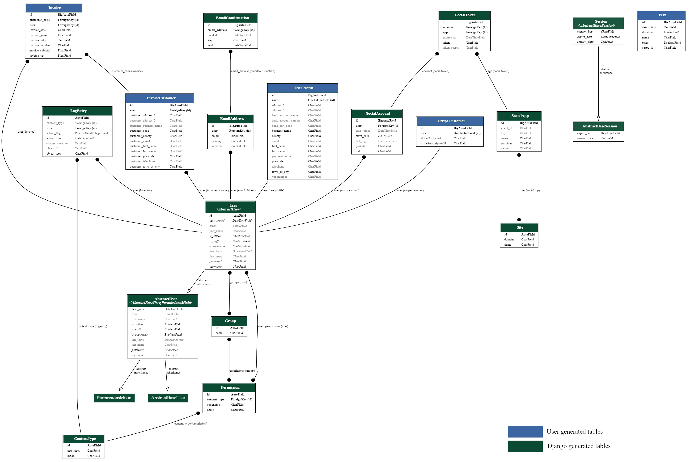

[Heroku Postgres](https://elements.heroku.com/addons/heroku-postgresql) is used for the deployed database, with SQLite being used in the development environment. 

The final schema is as detailed in the image above, where green boxes are Django/Allauth tables and blue boxes relate to the custom code for the project.  Ideally this will be modified in later versions such that the invoice and customer tables become just foreign key tables linking subscribers to separate and distinct tables for their own data.

* Users - Django auth model, used for registration and foreign to trigger creation of subscriber profile.
* User Profile - Holds contact and basic business information which is used on invoices and to determine VAT calculations.
* Plans - Holds information for subscription plan options.
* Stripe Customer - links to User model and stores Stripe specific reference numbers.
* Invoice Customer - Contains the details of the customers of subscribers for inclusion on invoices.
* Invoice - Stores the actual invoice data, also for inclusion on the invoice when produced.

### **Skeleton**

#### Wireframes
1. [Mobile](documentation/documents/XXXXX-mobile-final.pdf) 375px
1. [Tablet](documentation/documents/XXXXX-tablet-final.pdf) 768px
1. [PC/Laptop](documentation/documents/XXXXX-pc-final.pdf) 1200px

##### Summary of Changes
* 

### **Surface**

#### Colours
The colours chosen are based on making the UI as clean and intuitive as possible.  A dark grey was chosen as the main colour and is used for nav, footer and the majority of body text.  
A bright orange was chosen as the highlight colour as warmer colours draw the attention better than cooler colours, and should therefore stand out more to the user as call to action items.  Red was not chosen because of negative connotations within the realms of finance, and a general association with danger/threat.  
The complimentary colours are all cool blues, with the intent to use for secondary buttons, hover colours etc.  In the end, the blues were used very little, keeping primarily to the orange and grey.  
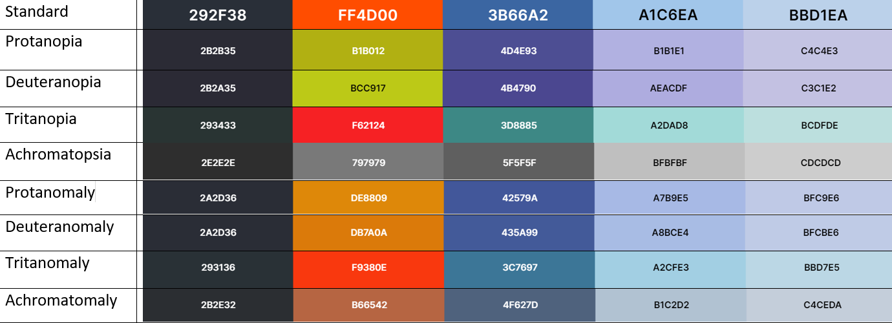

#### Typography
Only one font was really chosen for the site as the accent, for headers, logos and other items that need to stand out.  It was decided to proceed with the standard font used by Bootstrap for the majority of the body etc, as the creators will have chosen a suitably inclusive and easy to read design.
1. The accent font chosen was [Flamenco](https://fonts.google.com/specimen/Flamenco?preview.text=InvoicEasy&preview.text_type=custom) since it provides a stark contrast to the standard font used in Bootstrap 5, without being overly fussy or indicative of age or gender.

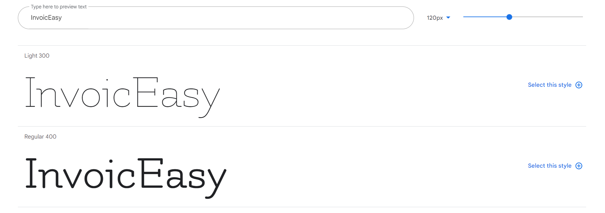

## Features

### **Existing Features**
Features common to all pages/sections:

#### **Responsive Design**
A large number of users are likely to access the site from mobile devices and tablets, given their widespread nature and ease of use.  The site has been designed such that all information is presented clearly and logically for as many device types as possible.

#### **Smart Pre-fills**
Nobody likes filling out forms, so when a user is signed in forms prefill with as much data as possible to reduce this burden.

#### **Account Dashboard**
The dashboard shows a high levels view of all important data, and has clear, obvious links to the three data inputs which complete an invoice.  Here, the user can easily see the status of their subscription, a list of all the invoices they have created, and a list of all their customers entered to date.  Each customer or invoice can be edited directly from the dashboard, and invoice view buttons are present for every invoice.

#### **Stripe Checkout**
As shown recently with the introduction of 3D secure payment technology as a mandatory requirement, embedded checkouts can become outdated resulting in users being unable to make payments.  By making use of Stripe checkout, this risk should be mitigated entirely.

#### **User Feedback **
Users are updated on the success or failure of their actions using toasts which can be closed by the user, but disappear automatically after a certain period of time.

#### **Defensive Design**
There is code in place to ensure that only signed in users can access restricted areas, only subscribed users can use the site functionalty, and that each user can only access their own data.

Users are prompted for confirmation before deletion of customers or invoices to prevent accidents.

### **Features for Future Implementation**
* A checkbox for recording whether an invoice is paid or not to aid in debtor management.
* The ability to email out invoices (and possibly explore automation for payment reminders?) to speed up the invoicing process further.
* Create documentation, the app isn't really big enough to need it at the moment, but help docs never hurt.
* Customer sub-accounts, have customers sign in to retrieve an invoice rather than send via email.
* Credit notes and statements, this would round out the full debtor management suite and allow a fuller service.

## Testing

This information is held in the [Testing](TESTING.md) file.

## Development Life Cycle
The project was deployed using Heroku immediately.  This allowed for immediate assessment of any issues in the deployment environment and enabled testing of the page during development on different devices.

Commits were made as each section of each page was added and pushed once a section was complete.  Branches were utilised for each major feature or change, and merged once confirmed functional and stable.

### **Reflections on General Approach to Build**
* The scope of the project initially was massively overstated, largely due to not recognising the time required to build the product as well as the e-commerce site for the project.
* Mid-project change of static/media files service drastically affected the timeline.  A number of days were lost to trying to work with Cloudinary, and despite extended tutor time, nobody was able to resolve the issue.  Instead, very eventually, Whitenoise was chosen to serve the project and implemented cleanly straight away.
* The Heroku/Github security issue also had an effect, since the established deployment practice could no longer be used and essentially needed to be redeployed with a new approach.

### **Lessons Learned**
* Pursuing an issue to try and make it work isn't always the best course of action.  Sometimes finding a different way to achieve what is needed is more efficient.
* Stripe webhooks were difficult to test in the development environment, and I would definitely seriously consider using other payment providers in future.
* The importance of branches was proven a number of times through incompatible Django extensions and the attempted use of inappropriate tutorials or technologies.

## Deployment

The website was created using [GitPod](https://www.gitpod.io/). Version control was undertaken by committing to [Git](https://git-scm.com/) and pushing to [GitHub](https://github.com/) using the functions within GitPod.  [Heroku]((https://heroku.com/)) was used to deploy the live site.

### **Deployment of the Page**
Continuous deployment via GitHub-Heroku link was utilised intially for this project.  As such, deployment was amongst the first tasks undertaken.  The security issue with Heroku and Github then forced manual deployment via the Heroku CLI.

1. In the IDE, ensure that a small test application exists, and all changes are committed and pushed to GitHub.
1. Create a requirements file, which will be used by Heroku in creation of the deployment.
    * In the terminal, type "pip3 freeze --local > requirements.txt".
    * Commit this to Git.
1. Create a Procfile, which is used by Heroku to determine the language for the app.
    * In the terminal, type "echo web: python app.py > Procfile".
    * This is case sensitive, and should have a capital P, and should have no file extension.
    * Commit this to Git.
1. Push these files to GitHub.
1. [Sign in to Heroku](https://id.heroku.com/login) (or [create a Heroku account](https://signup.heroku.com/) if you do not already have one), and choose "New > Create New App".
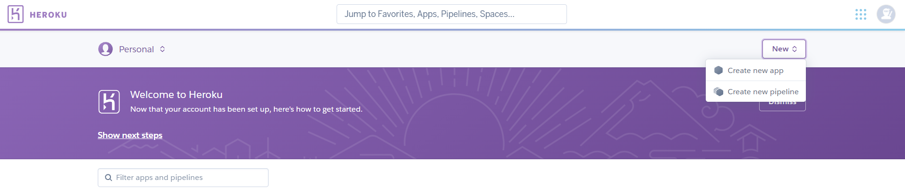
1. Choose an app name, which must be unique, and select the nearest region.  Then click "Create App".
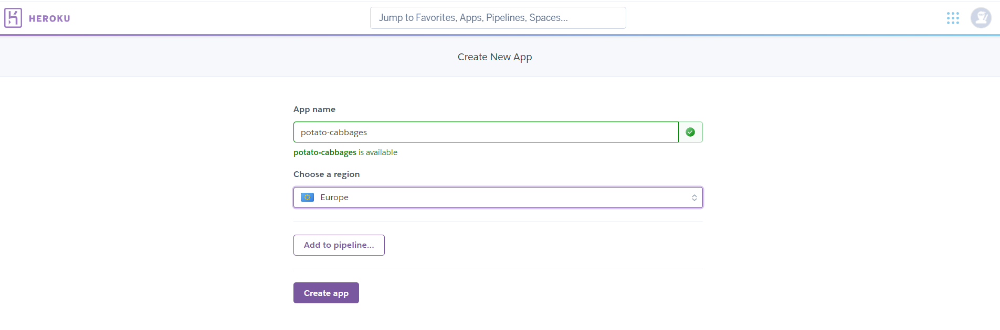

#### **Automated deployment via Github (no longer available)**
1. Once generated choose the "Deploy" tab, select "Connect to GitHub" sub-tab and click the "Connect to GitHub" button.
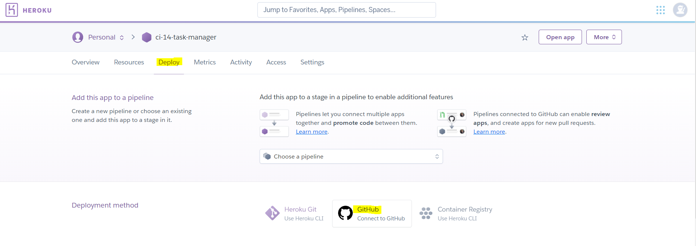
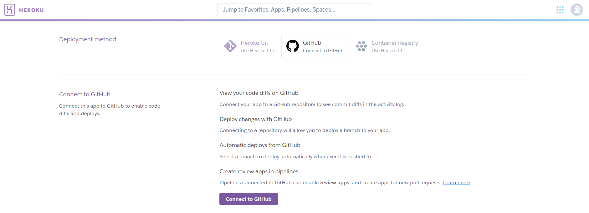
1. Follow the on-screen instructions to link Heroku to your GitHub account.
1. Click the "Settings" tab from the main menu, and scroll down to find "Reveal Config Vars".  This section should be populated with any sensitive data which is not appropriate to send to GitHub, usually in an "env.py" document.
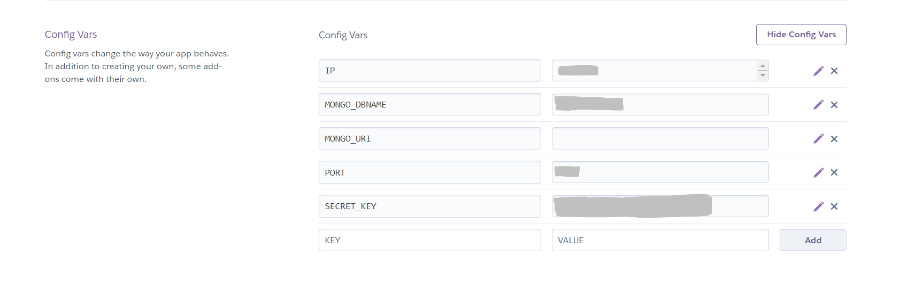
1. Back on the Deploy tab, once linked, Heroku will prompt for the repository name, complete this and click "Search".
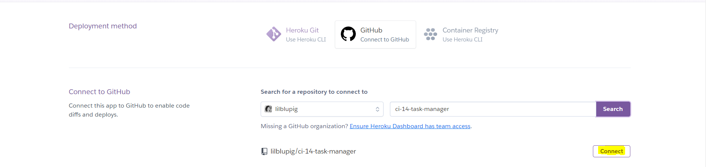
1. The repo listing should appear, click "Connect".
1. Heroku will process the request before showing that the connection has been made successfully, and showing two new options.  Click the first of these, which is to "Enable Automatic Deploys".
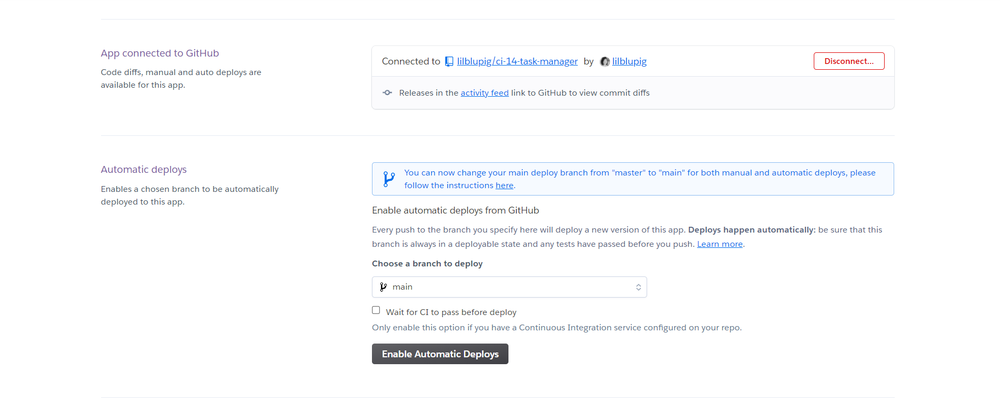
1. The second option is to "Deploy Branch".  Click the button and Heroku will process for some time.
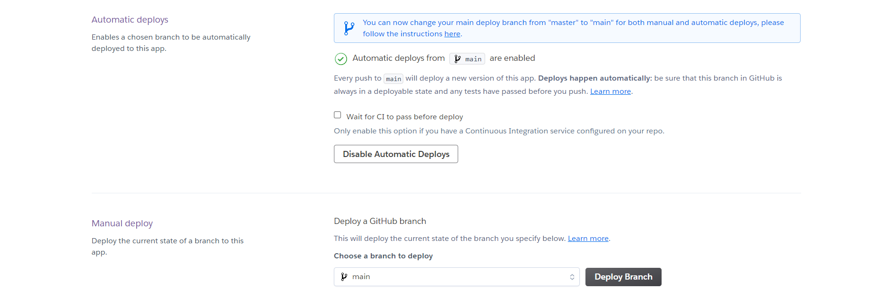
1. Once complete, Heroku will display a checklist, followed by a "View" button.  Click this to open the app in a new tab.
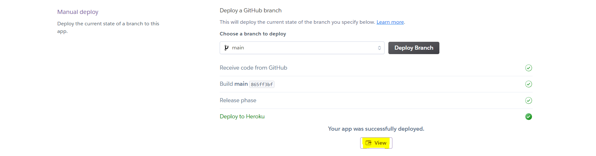
1. Celebrate! Your app should now update in line with any changes pushed to GitHub.

#### **Using Heroku CLI**
1. In Gitpod, in the terminal, log in to Heroku: $ heroku login -i
1. When prompted, enter your username and password.
1. Having made sure the regular Git remote is updated and all commits are pushed, use the terminal to puch the code to Heroku: $ git push heroku main
1. If another branch is to be deployed, use: $ git push heroku branchname:main
1. The terminal will spend some time processing, and this is mirrored in Heroku Activity tab.  Once complete the deployed app should be available.

### **How to Clone and Run the Code Locally**
There are slightly different approaches should you choose to use GitPod to clone the project, or a local IDE.

#### Cloning a Project into GitPod
1. Use [Google Chrome](https://www.google.com/intl/en_uk/chrome/). *(This can also be undertaken in Firefox)*
1. If you do not already have one, [create a GitHub account](https://github.com/join).
1. Install the [GitPod browser extension for Chrome](https://chrome.google.com/webstore/detail/gitpod-dev-environments-i/dodmmooeoklaejobgleioelladacbeki). *(Or Firefox if appropriate)*
1. Restart Chrome.
1. In GitHub, find the [project repository](https://github.com/ci-14-task-manager).
1. From the repository menu, choose the green GitPod button.
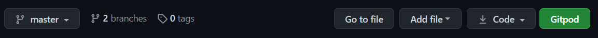
1. A new GitPod workspace will open containing the project code.
1. Use the requirements file to install required dependencies.

You can find more information on cloning a repository from GitHub [here](https://docs.github.com/en/github/creating-cloning-and-archiving-repositories/cloning-a-repository).

## Technologies Used

### **Languages**
* HTML5 is used to provide the basic structure of the website.
  * About: [HTML5 Wiki](https://en.wikipedia.org/wiki/HTML5)
  * Creator: [W3 Consortium](https://www.w3.org/)
* CSS3 is used to provide most of the styling for the website.
  * About: [CSS3 Wiki](https://en.wikipedia.org/wiki/CSS)
  * Creator: [W3 Consortium](https://www.w3.org/)
* JavaScript is used to provide the interactive nature of such components throughout the website.
  * About: [JavaScript Home](https://www.javascript.com/)
* Python is the primary programming language used to create the application.
  * About: [Python Home](https://www.python.org/)

### **Libraries, Frameworks, Apps and Extensions**
* The [Django](https://www.djangoproject.com/) framework is used to facilitate efficient app building and include basic security.
* [AllAuth](https://django-allauth.readthedocs.io/en/latest/installation.html) is used for all user account functionality.
* [Crispy Forms](https://pypi.org/project/crispy-bootstrap5/) is used to power forms used on the site.
* [Stripe](https://stripe.com/gb) provides secure checkout.
* [Whitenoise](http://whitenoise.evans.io/en/stable/index.html) is used to serve static files.
* [PostgreSQL](https://www.postgresql.org/) is used for the production database via the Heroku Add-On Heroku Postgres.
* [DJ Database URL](https://pypi.org/project/dj-database-url/) is used to facilitate PostgreSQL.
* [Psycopg](https://pypi.org/project/psycopg2-binary/) is also used to facilitate PostgreSQL.
* [Gunicorn](https://gunicorn.org/) is used as the Python server.
* [SQLite3](https://www.sqlite.org/index.html) is used for the development database.
* [xhtml2pdf](https://pypi.org/project/xhtml2pdf/) is used to produce the PDFs.
* [Django Extensions - PyDotPlus](https://pypi.org/project/pydotplus/) is used to produce the database schema.
* [Coverage](https://pypi.org/project/django-coverage/) is used to check the percentage of code assessed by automated tests.
* [jQuery](https://jquery.com/) is used to simplify the implementation of interactive JavaScript components.
* [Bootstrap 5](https://getbootstrap.com/) is used to provide the grid functionality for uniform design, responsiveness and to enable the use of modal and hamburger menu.
* [Google Fonts](https://fonts.google.com/) are used to provide the typography for the website.
* [Heroku](https://heroku.com/) is used to host the deployed site.

### **Tools**
* [Git](https://git-scm.com/)/[GitHub](https://github.com/) was used for version control and repository storage.
* [GitPod](https://www.gitpod.io/) was the IDE used to write the project.
* [Chrome Dev Tools](https://developers.google.com/web/tools/chrome-devtools) were used for specific responsiveness testing and drilling down into bug fixing.
* [Lighthouse](https://developers.google.com/web/tools/lighthouse) was used for macro testing and identification of accessibility/SEO errors for rectification.
* [W3C CSS Validation Service](https://jigsaw.w3.org/css-validator/) was used to remove any remaining errors in CSS code.
* [W3C HTML Validation Service](https://validator.w3.org/) was used to remove any remaining errors in HTML code.
* [JS Hint Validation Service](https://jshint.com/) was used to check for major errors in JavaScript.
* [PEP8 Online](http://pep8online.com/checkresult) was used to validate the Python code, alongside the Gitpod linter included in the CI template.
* [Responsively](https://responsively.app/) was used to explore responsiveness across various devices.
* [GraphVizOnline](https://dreampuf.github.io/GraphvizOnline/) is used to translate the database schema dot file to a visual image.

### **Other Resources**
* [Code Institute Full Template](https://github.com/Code-Institute-Org/gitpod-full-template) was used to set up the repository.
* The following projects created by fellow Code Institute students gave great inspiration and were used to benchmark/guide my own project:
  * [Which Way is Up](https://github.com/lemocla/Which-way-is-up) by [Claire](https://github.com/lemocla).
  * [Postfly](https://github.com/Daph1986/postfly_jouw_online_drukkerij) by [Daphne Heimgartner](https://github.com/Daph1986)
  * [Code With Mike](https://github.com/MikeAvgeros/code-with-mike) by [Mike Avgeros](https://github.com/MikeAvgeros)
  * [Cost Report](https://github.com/dkeddie/MS4-Cost-Report) by [dkeddie](https://github.com/dkeddie)

## Credits

### **Website Credits**

#### Content
The website content is original, but the following resources and tutorials were used in production and troubleshooting of the site.
* [Django docs](https://docs.djangoproject.com/en/3.2/)
* [Whitenoise setup](http://whitenoise.evans.io/en/stable/django.html)
* [Stripe Subscritptions](https://testdriven.io/blog/django-stripe-subscriptions/)
* [Stripe Documentation](https://stripe.com/docs/billing/subscriptions/)
* [Django contact mail article](https://ordinarycoders.com/blog/article/build-a-django-contact-form-with-email-backend)
* [Dates conversion](https://www.tutorialspoint.com/How-to-convert-an-integer-into-a-date-object-in-Python#:~:text=You%20can%20use%20the%20fromtimestamp,object%20corresponding%20to%20the%20timestamp.)
* [Difference between Static and Media for relative paths](https://stackoverflow.com/questions/37241902/django-joined-path-is-located-outside-of-the-base-path-component-static-img)
* [Save user as foreign key to form](http://www.learningaboutelectronics.com/Articles/How-to-save-the-current-user-logged-in-to-a-database-table-in-Django.php)
* [Access user in form.py](https://stackoverflow.com/questions/7299973/django-how-to-access-current-request-user-in-modelform/7300076#7300076) Clues here also from mentor Reuben Ferrante
* [Real Python](https://realpython.com/django-redirects/)
* [Join data, but in Django](https://stackoverflow.com/questions/860941/how-to-do-this-join-query-in-django)
* [How to make PDF tutorial](https://medium.com/nerd-for-tech/a-beginners-guide-to-generate-pdf-s-with-django-part-1-901e258f0f93)
* [xhtml2pdf docs](https://xhtml2pdf.readthedocs.io/en/latest/format_html.html#)
* [Display 2 decimal places](https://stackoverflow.com/questions/23739030/restrict-django-floatfield-to-2-decimal-places)
* [Active nav items](https://stackoverflow.com/questions/25044370/make-clicked-tab-active-in-bootstrap)
* [Mocking users](https://stackoverflow.com/questions/2036202/how-to-mock-users-and-requests-in-django)
* [Mocking with foreign keys(accepted answer)](https://stackoverflow.com/questions/53907647/django-tests-py-django-db-utils-integrityerror-unique-constraint-failed-auth-u)
* [Create DB schema](https://medium.com/@yathomasi1/1-using-django-extensions-to-visualize-the-database-diagram-in-django-application-c5fa7e710e16)

#### Media
* The photographs used for the website were obtained from [Unsplash](https://unsplash.com/):
  * [Bulldog clip of papers](https://unsplash.com/photos/bSkAq6XEYyk)
  * [Artisan office](https://unsplash.com/photos/cWpgJrVgkr0)
  * [Telephone](https://unsplash.com/photos/-0xCCPIbl3M)
  * [Typewriter](https://unsplash.com/photos/jLwVAUtLOAQ)
  * [Stamp](https://unsplash.com/photos/e-CqOxx8oXw)
  * [Coin jar](https://unsplash.com/photos/SoqG9RWd_FA)
  * [Paper list](https://unsplash.com/photos/onP8BIHPkrc)
  * [Padlock](https://unsplash.com/photos/XUJcmgEhpjA)
  * [Enter arrow](https://unsplash.com/photos/J59wWPn09BE)
  * [See you later sign](https://unsplash.com/photos/v_WLk_vNYRA)
  * [Keys](https://unsplash.com/photos/C1P4wHhQbjM)
  * [Hola sign](https://unsplash.com/photos/8MMtYM_3xMY)
  * [Filing boxes](https://unsplash.com/photos/lRoX0shwjUQ)
  * [Girl with Binoculars](https://unsplash.com/photos/1bhp9zBPHVE)
  * [Broken ice cream](https://unsplash.com/photos/WtRuYJ2EPMA)

* The icons used for the website are from [FlatIcon]():
  * [Monitor in Logo - created by DinosoftLabs](https://www.flaticon.com/free-icons/monitor>)

#### Acknowledgements
Thank you in particular to:
* Reuben Ferrante for mentoring the project.
* [Tutor James](https://github.com/asdfractal) for pointing me to Whitenoise when Cloudinary perpetually refused to work.
* [Tutor Scott](https://github.com/ShavingSeagull) for working out that my textbook automated test required a subscription to view the page.

### **README Credits**

#### Content
Structure and content based heavily on:
* [Code Institute Solutions - README Template](https://github.com/Code-Institute-Solutions/readme-template)
* [Daisy McGirr - Code Institute Testing Webinar](https://us02web.zoom.us/rec/play/9FIKllHX2ZiQNFRhYPn_hBh_ZeA8964ZvIDLnhpKGAf1NLVc3_hBJ6zSL8Hv5Hx7ALnPtDmbg8CmFAs.YVsZ9LR_uI7OjEwH)

#### Media
The images for this README are from the following sources:
* Snips taken from GitHub.
* [Am I Responsive](http://ami.responsivedesign.is/).
* Wireframes created with [Balsamiq](https://balsamiq.com/).
* Colour mockups created with [Coolors](https://coolors.co/).
* Snips taken of Google Fonts.

#### Other
* Markdown basic taken from [Mastering Markdown](https://guides.github.com/features/mastering-markdown/).

**This website was produced as an educational project for the Code Institute Full Stack Development course.**

**Created by Amy Hacker.**

[Back to Top](#invoiceasy)