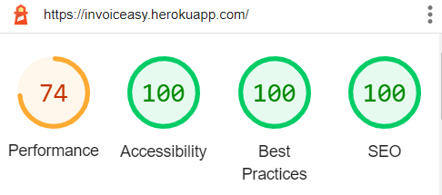
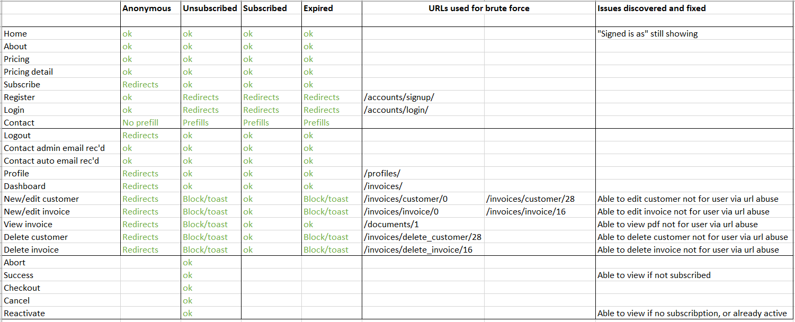

# **InvoicEasy**

# Testing

A plan and log for testing the website, this is primarily a manual testing plan due to the limitations of the developer at this time.

# Index
1. [Validation Testing](#validation-testing)
1. [Automated Testing](#automated-testing)
1. [Logic Error Testing](#logic-error-testing)
1. [Client Stories Testing](#client-stories-testing)
1. [Manual Testing](#manual-testing)
    * [Common Elements](#common-elements)
    * [Page Specific Sections](#page-specific-sections)
    * [Accessibility](#accessibility)
1. [Bugs](#bugs)

## Validation Testing
The project code has been passed through the following code validators:
* [HTML Code Validator](https://validator.w3.org/) Public facing pages were tested by url, and restricted pages were tested by copying the page source code of the deployed site from the browser and pasting into the validator.
 Validator results (PDF):
  * [Home](html-validation/home.pdf)
  * [About](html-validation/about.pdf)
  * [Pricing](html-validation/products-pricing.pdf)
  * [Pricing Detail](html-validation/products-pricing-detail.pdf)
  * [Contact](html-validation/contact.pdf)
  * [Register](html-validation/accounts-register.pdf)
  * [Login](html-validation/accounts-login.pdf)
  * [Dashboard](html-validation/invoices-dashboard.pdf)
  * [New/Manage Customer](html-validation/invoices-new-customer.pdf)
  * [New/Manage Invoice](html-validation/invoices-new-invoice.pdf)
  * [Profile](html-validation/profile.pdf)
  
* [CSS Code Validator](https://jigsaw.w3.org/css-validator/) Clean with one warning: External stylesheets are not checked
  * [CSS Validation (PDF)](css-validation/css-validation.pdf)
  
* [JS Hint](https://jshint.com/) was used to check the Javascript used in the project, showing only warnings related to the use of phrases which are only compatible with ES6.
  * [JS Validation (PDF)](js-validation/js-validation.pdf)
  
* [PEP8 Online](http://pep8online.com/) was used to check the formatting for all python files containing custom code.  System generated files which were not modified were not checked.  Due to the large number of files, the results of this were not documented.  There were a number of 'line too long' and some 'too many blank lines' issues which were resolved during the process.
  
* The project has been assessed throughout development using [Lighthouse](https://developers.google.com/web/tools/lighthouse).

There were some contrast issues with smaller headers and buttons, and some SEO changes for meta to make.  Moving forward, I would like to improve efficiency around the images to improve performance.

## Automated Testing
Some automated tests were undertaken for the site, particularly around get and post responses.  Mixed assistance was received from tutors in this area.  One tutor helped to identify that a required subscription was blocking a test on the get views for new/edit customers/invoices.  On requesting assistance with the post views of the same test the following day I was just advised not to proceed ([see transcript](coverage-reports/invoices-test-help-request.txt)).  As such the automated tests are not as extensive as anticipated, PDF coverage reports are as follows:
| # | App | Coverage | Breakdowns |
|---| ------- | --------: | ------- |
1.| [Home](coverage-reports/home-overview.pdf) | 100% | N/A |
2.| [Contact](coverage-reports/contact-overview.pdf) | 93% | [Contact Views](coverage-reports/contact-views-breakdown.pdf) |
3.| [Products](coverage-reports/products-overview.pdf) | 100% | N/A |
4.| [Profiles](coverage-reports/profiles-overview.pdf) | 90% | [Profiles Models](coverage-reports/profiles-models-breakdown.pdf), [Profiles Views](coverage-reports/profiles-views-breakdown.pdf)
5.| [Invoices](coverage-reports/invoices-overview.pdf) | 85% | [Invoices Views](coverage-reports/invoices-views-breakdown.pdf) |
6.| [Subscriptions](coverage-reports/subscriptions-overview.pdf) | 51% | [Subscriptions Models](coverage-reports/subscriptions-models-breakdown.pdf), [Subscriptions Views](coverage-reports/subscriptions-views-breakdown.pdf) |
7.| [Documents](coverage-reports/documents-overview.pdf) | 98% | [Documents Utils](coverage-reports/documents-utils-breakdown.pdf) |
-| Overall (mean average) | 88% |

It was intended to make use of the xhtml2pdf unit tests and functional tests, however the steps as [outlined in the docs](https://xhtml2pdf.readthedocs.io/en/latest/howto-running-tests.html) just resulted in errors in the terminal, likely due to the age of the extension.

## Logic Error Testing
1. The site was browsed extensively with the console open and the terminal visible.  During the testthere were no errors or print statements visible in either the console or terminal.

1. An attempt was made to access each restricted page directly via url as one of four user types:
* Anonymous
* Unsubscribed but registered
* Currently subscribed
* Subscription expired

A number of security holes were found and patched, and some minor pages which should not be accessible at this time remain so.

### **Fixed Items**
* "Signed in as XXX" was showing for Anonymous users, which is incorrect.  This was fixed with an if statement on the template.
* It was possible for a logged in user to access the documents of others directly using the url for that document.  A statement was added which compares the id of the user to the user_id foreign keys for invoices and customers to prevent this.
* Some of the checkout pages (notably success and reactivate) were accessible by users who had no subscription, which could imply that that user now has a subscription and cause confusion.  These pages have been restricted to view by only users with a valid subscription.  This is still not ideal, but at least should not confuse users.

### **Items Awaiting Fix**
* The checkout pages issue above requires attention.  A possible fix is to add logic which means the pages will only be viewable if they were referred by a particular source, which should prevent this issue.

## Client Stories Testing
1. As a new user, I want to 
    1. 
    1. 
    
1. As a new user, I want to 
    1. 
    1. 
    
1. As a new user, I want to l
    1. 
    
1. As a returning user, I want to 
    1. 
    
1. As a returning user, I want to 
    1. 
    1. 
    
1. As a frequent user, I want to 
    1. 
    

## Manual Testing

### **Common Elements**

These components are present on every page, and each page has been tested.

---

#### Navigation Bar

**Intent** - a navbar which collapses to hamburger on mobile.

* All links are valid and link to the appropriate page.
* Logo alt displays on hover (added title attribute).
* Hover effect occurs correctly for each navigation section.
* Active class is applied correctly for current page.
* Resize to mobile/tablet and check that navigation bar collapses to hamburger.
* Expand hamburger menu and check all sections present, and displaying correctly.

**Result** - `Text here to explain what happened when tested`

**Verdict** - XXXX

---

#### Hero Images

**Intent** - a full width image relevant to the page content, different for each page.  Primary purpose, to elicit a positive emotional response from the user.  The image should display correctly on all device sizes.  The image should display XXX% height on the home page and XXX% on the 404 page to display redirect information.

* Image fills the viewport as expected depending on page.
* Resize to mobile/tablet and check that image still displays without distortion.
* Text remains centered with no overflow at mobile/tablet.

**Result** - `Text here to explain what happened when tested`

**Verdict** - XXXX

---

#### Footer

**Intent** - The footer should be reflective of the design of the nav to bookend each page and provide familiarity to the user.  This helps with intuitive learning.  Any external links should open in new tabs and provide user feedback when hovered over.

* Footer appears in XXX sections.
* Social media icons display correctly, and show feedback behaviour on hover.
* Social links open in new tabs to correct locations.
* Resize to tablet and check for text overflow issues.
* Resize to mobile and check that sections wrap neatly below one another.

**Result** - `Text here to explain what happened when tested`

**Verdict** - XXXX

---

### **Page Specific Sections**

These items are specific to each individual page.

#### Basic Plan for Body Sections
* Check all areas of text align appropriately, horizontally and vertically.
* Check that behaviour is correct for mobile/tablet.
* Check that any links, buttons or fields show feedback behaviour on hover.
* Check that any links navigate to correct pages.
* Check that any external links open in a new tab, to the correct place.
* Check that any icons do not overflow into text on mobile/tablet.

---

#### Contact Us

**Intent** - Encourage the user to get in touch with the owners, and make it as easy as possible to do so.

* All text sections display correctly across tested device widths.
* All buttons display user feedback on hover.
* All internal links navigate to the correct page.

Contact Us Form
* Form contents align nicely and that there is no overflow of content.
* Fields display correctly on mobile/tablet and PC.
* Placeholder text displays in fields.
* Fields and submit button display feedback on hover.
* Fields display feedback on focus.
* Try to submit blank form, error messages display with information.
* Try to submit email in incorrect format, error message displays with information.
* Try to submit form without question, error message displays with information.
* Submit correctly completed form, receive success modal.
* Modal information centers correctly with no overflow on all device widths.

**Result** - `Text here to explain what happened when tested`

**Verdict** - XXXX

---
#### 404

**Intent** - Catch users who would normally encounter a browser generated 404 page, and redirect them back to the website as cleanly as possible.

* All text sections display correctly across tested device widths.
* All buttons and links display user feedback on hover.
* All internal links navigate to the correct page.
* User is guided back to the home page.
* Mistyped url for website to ensure 404 page displays in such situations.
* Deliberately broke page link to ensure 404 page will display in this instance too.

**Result** - `Text here to explain what happened when tested`

**Verdict** - XXXX

---

### **Accessibility**

The colourblind feature on Coolors was used to check that the colours appeared sufficiently different, and not jarring for these users.

As well as the use of the Lighthouse assessments of accessibility, the website was browsed at intervals by two users who may experience difficulty.  A dyslexic user with ASD and a colourblind user both XXXXX.

## Bugs

Details of any persistent or difficult bugs, and any bugs which remain unresolved.

### **Fixed Bugs**

### **Remaining Bugs**

Testing first completed XX/XX/2021 - AKH
Testing repeated XX/XX/2021 - AKH

[Return to Top](#title)