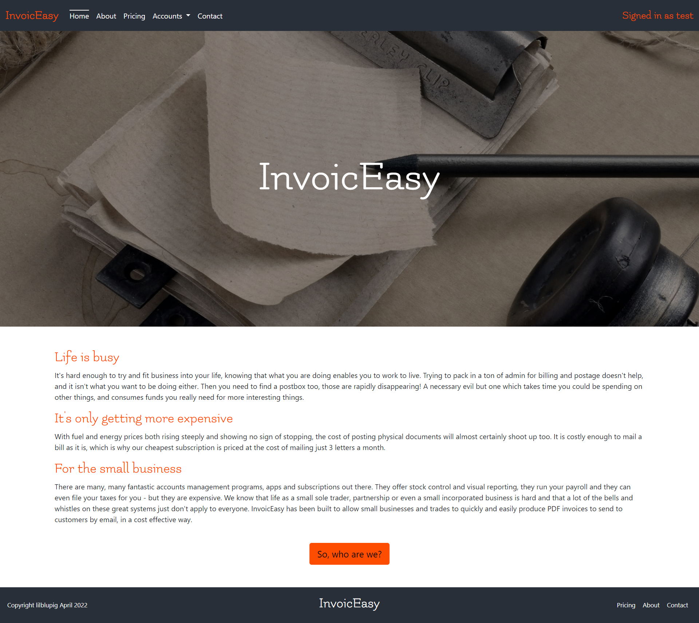
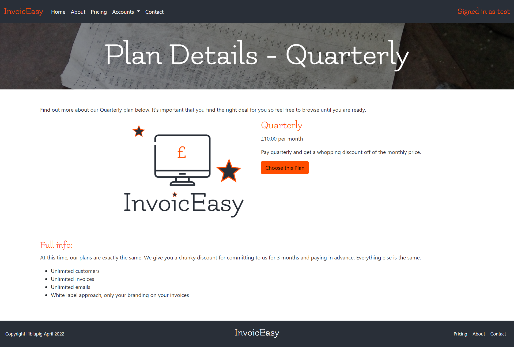
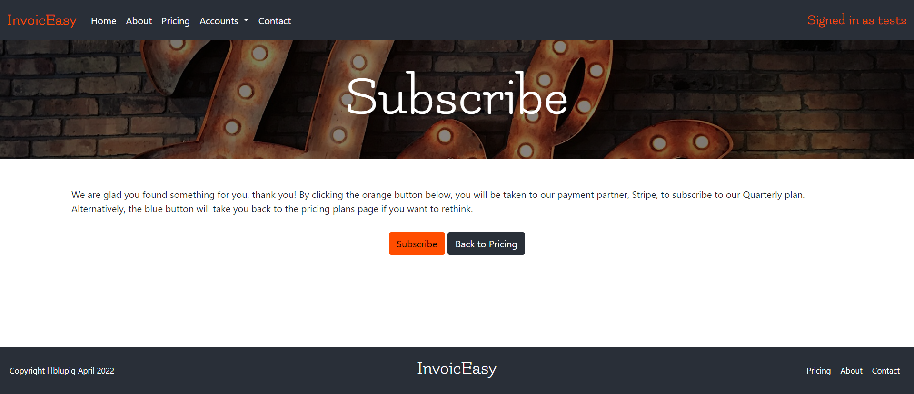
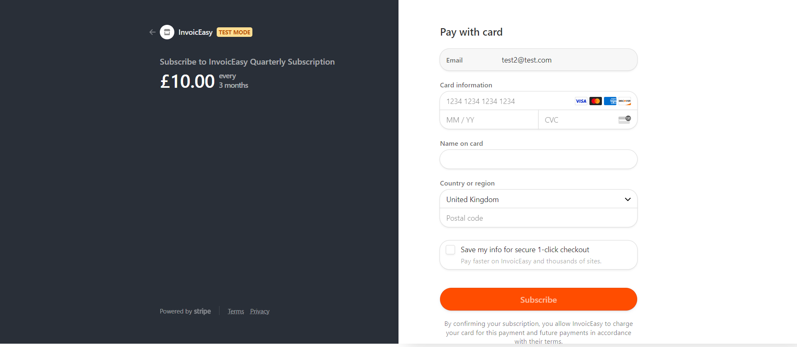
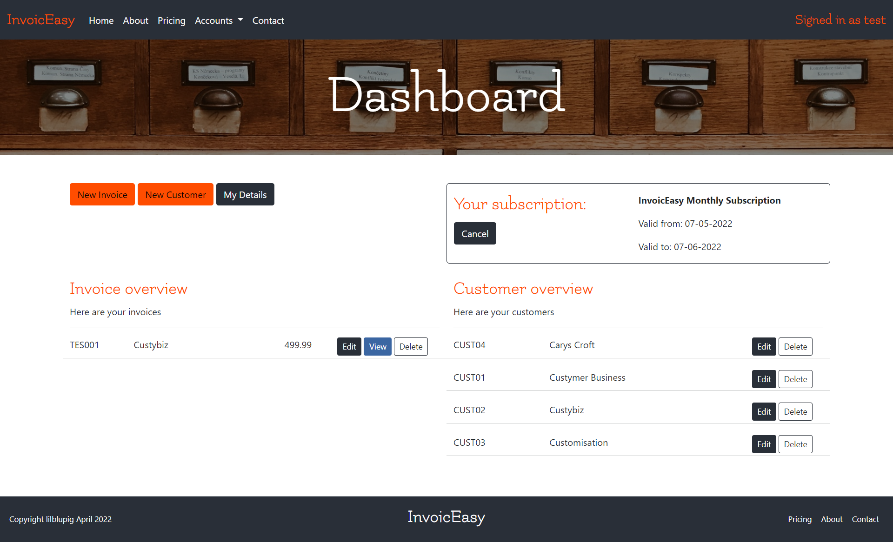
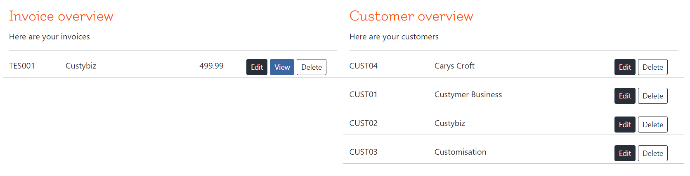
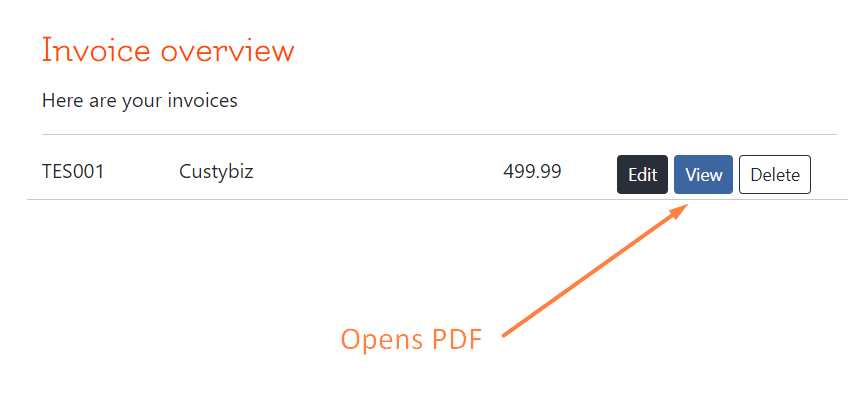
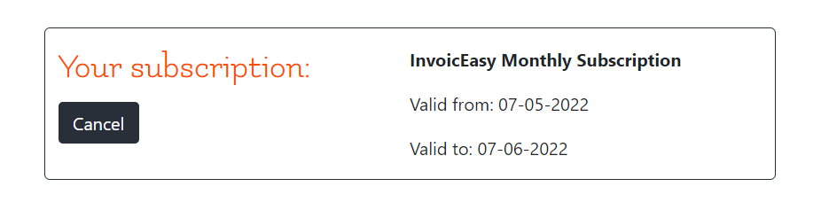
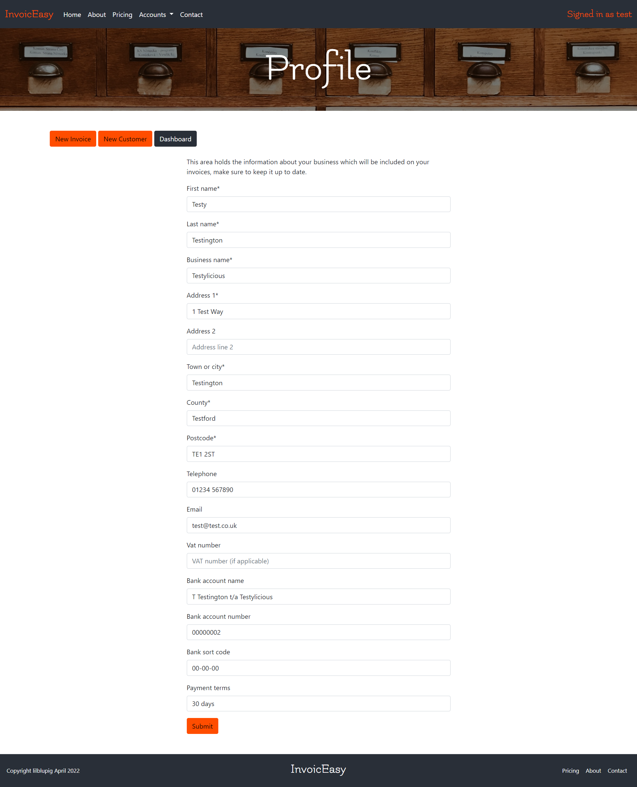
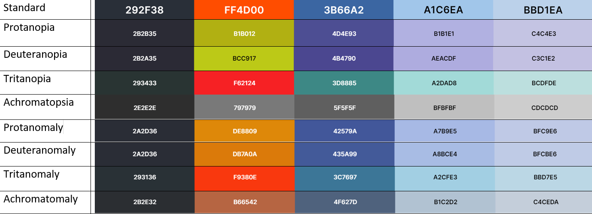

# **InvoicEasy**

# Testing

A plan and log for testing the website, this is primarily a manual testing plan due to the limitations of the developer at this time.

# Index
1. [Validation Testing](#validation-testing)
1. [Automated Testing](#automated-testing)
1. [Logic Error Testing](#logic-error-testing)
1. [Client Stories Testing](#client-stories-testing)
1. [Manual Testing](#manual-testing)
    * [Common Elements](#common-elements)
    * [Page Specific Sections](#page-specific-sections)
    * [Accessibility](#accessibility)
1. [Bugs](#bugs)

## Validation Testing
The project code has been passed through the following code validators:
* [HTML Code Validator](https://validator.w3.org/) Public facing pages were tested by url, and restricted pages were tested by copying the page source code of the deployed site from the browser and pasting into the validator.
 Validator results (PDF):
  * [Home](html-validation/home.pdf)
  * [About](html-validation/about.pdf)
  * [Pricing](html-validation/products-pricing.pdf)
  * [Pricing Detail](html-validation/products-pricing-detail.pdf)
  * [Contact](html-validation/contact.pdf)
  * [Register](html-validation/accounts-register.pdf)
  * [Login](html-validation/accounts-login.pdf)
  * [Dashboard](html-validation/invoices-dashboard.pdf)
  * [New/Manage Customer](html-validation/invoices-new-customer.pdf)
  * [New/Manage Invoice](html-validation/invoices-new-invoice.pdf)
  * [Profile](html-validation/profile.pdf)
  
* [CSS Code Validator](https://jigsaw.w3.org/css-validator/) Clean with one warning: External stylesheets are not checked
  * [CSS Validation (PDF)](css-validation/css-validation.pdf)
  
* [JS Hint](https://jshint.com/) was used to check the Javascript used in the project, showing only warnings related to the use of phrases which are only compatible with ES6.
  * [JS Validation (PDF)](js-validation/js-validation.pdf)
  
* [PEP8 Online](http://pep8online.com/) was used to check the formatting for all python files containing custom code.  System generated files which were not modified were not checked.  Due to the large number of files, the results of this were not documented.  There were a number of 'line too long' and some 'too many blank lines' issues which were resolved during the process.
  
* The project has been assessed throughout development using [Lighthouse](https://developers.google.com/web/tools/lighthouse).

There were some contrast issues with smaller headers and buttons, and some SEO changes for meta to make.  Moving forward, I would like to improve efficiency around the images to improve performance.

## Automated Testing
Some automated tests were undertaken for the site, particularly around get and post responses.  Mixed assistance was received from tutors in this area.  One tutor helped to identify that a required subscription was blocking a test on the get views for new/edit customers/invoices.  On requesting assistance with the post views of the same test the following day I was just advised not to proceed ([see transcript](coverage-reports/invoices-test-help-request.txt)).  As such the automated tests are not as extensive as anticipated, PDF coverage reports are as follows:
| # | App | Coverage | Breakdowns |
|---| ------- | --------: | ------- |
1.| [Home](coverage-reports/home-overview.pdf) | 100% | N/A |
2.| [Contact](coverage-reports/contact-overview.pdf) | 93% | [Contact Views](coverage-reports/contact-views-breakdown.pdf) |
3.| [Products](coverage-reports/products-overview.pdf) | 100% | N/A |
4.| [Profiles](coverage-reports/profiles-overview.pdf) | 90% | [Profiles Models](coverage-reports/profiles-models-breakdown.pdf), [Profiles Views](coverage-reports/profiles-views-breakdown.pdf)
5.| [Invoices](coverage-reports/invoices-overview.pdf) | 85% | [Invoices Views](coverage-reports/invoices-views-breakdown.pdf) |
6.| [Subscriptions](coverage-reports/subscriptions-overview.pdf) | 51% | [Subscriptions Models](coverage-reports/subscriptions-models-breakdown.pdf), [Subscriptions Views](coverage-reports/subscriptions-views-breakdown.pdf) |
7.| [Documents](coverage-reports/documents-overview.pdf) | 98% | [Documents Utils](coverage-reports/documents-utils-breakdown.pdf) |
-| Overall (mean average) | 88% |

It was intended to make use of the xhtml2pdf unit tests and functional tests, however the steps as [outlined in the docs](https://xhtml2pdf.readthedocs.io/en/latest/howto-running-tests.html) just resulted in errors in the terminal, likely due to the age of the extension.

## Logic Error Testing
1. The site was browsed extensively with the console open and the terminal visible.  During the testthere were no errors or print statements visible in either the console or terminal.

1. An attempt was made to access each restricted page directly via url as one of four user types:
* Anonymous
* Unsubscribed but registered
* Currently subscribed
* Subscription expired

A number of security holes were found and patched, and some minor pages which should not be accessible at this time remain so.

### **Fixed Items**
* "Signed in as XXX" was showing for Anonymous users, which is incorrect.  This was fixed with an if statement on the template.
* It was possible for a logged in user to access the documents of others directly using the url for that document.  A statement was added which compares the id of the user to the user_id foreign keys for invoices and customers to prevent this.
* Some of the checkout pages (notably success and reactivate) were accessible by users who had no subscription, which could imply that that user now has a subscription and cause confusion.  These pages have been restricted to view by only users with a valid subscription.  This is still not ideal, but at least should not confuse users.

### **Items Awaiting Fix**
* The checkout pages issue above requires attention.  A possible fix is to add logic which means the pages will only be viewable if they were referred by a particular source, which should prevent this issue.

## Client Stories Testing
1. As a new user, I want to learn quickly what InvoicEasy is, and how it can help me. 
    1. The home page has an overview of the product.
    
    1. The pricing pages supply more detailed information about what is involved for each plan.
    
1. As a new user, I want to follow as simple a process as possible to sign up, having chosen my plan. 
    1. One click from the Plan details page and the Subscribe page explains what will happen during sign up and payment.
    
    1. One more click and the Stripe Checkout appears, with user email prefilled.
    
1. As a new user, I want to intuitively understand how the system works, and get started right away.
    1. The Dashboard has buttons which go straight to all the components for an invoice, 'My Details' for the subscriber business info, 'New Customer' to set up someone to invoice and 'New Invoice' to create an invoice.
    
1. As a returning user, I want to see my existing customers and invoices readily, so I don't duplicate input. 
    1. The Dashboard shows a list of all existing Customers and Invoices.
    
1. As a returning user, I want to be able to reproduce and resend invoices quickly to customers who have not yet paid. 
    1. The 'View' button on all invoices will open a PDF in the browser ready to check and download.
    
1. As a frequent user, I want to be able to see and manage my subscription information.
    1. This is present on the Dashboard, with the option to cancel if a subscription is current, resubscribe if the subscription is cancelled but still valid or visit the pricing page if the subscription has expired.
    
1. As a frequent user, I want to be able to see and manage my own business information.
    1. This can be done using the Profile form, which is accessible from the Dashboard, and from the navbar when signed in.
    

## Manual Testing

### **Common Elements**

These components are present on every page, and each page has been tested.

---

#### Navigation Bar

**Intent** - a navbar which collapses to hamburger on mobile.

* All links are valid and link to the appropriate page.
* Hover effect occurs correctly for each navigation section.
* Active class is applied correctly for current page for main links.
* Resize to mobile/tablet and check that navigation bar collapses to hamburger.
* Expand hamburger menu and check all sections present, and displaying correctly.

**Result** - `All behaviour as expected.`

**Verdict** - PASS

---

#### Hero Images

**Intent** - a full width image relevant to the page content, different for each page.  Primary purpose, to elicit a positive emotional response from the user.  The image should display correctly on all device sizes.  The image should display 90% height on the home page and 30% on all other pages.

* Image fills the viewport as expected depending on page.
* Resize to mobile/tablet and check that image still displays without distortion.
* Text remains centered with no overflow at mobile/tablet.

**Result** - `Initial text overflow on narrow mobile, fixed with media query.`

**Verdict** - PASS

---

#### Footer

**Intent** - The footer should be reflective of the design of the nav to bookend each page and provide familiarity to the user.  This helps with intuitive learning.  Any external links should open in new tabs and provide user feedback when hovered over.

* Footer appears in three sections, two on mobile.
* Resize to tablet and check for text overflow issues.
* Resize to mobile and check that sections wrap neatly below one another.

**Result** - `All behaviour as expected.`

**Verdict** - PASS

---

### **Page Specific Sections**

These items are specific to each individual page.

#### Basic Plan for Body Sections
* Check all areas of text align appropriately, horizontally and vertically.
* Check that behaviour is correct for mobile/tablet.
* Check that any links, buttons or fields show feedback behaviour on hover.
* Check that any links navigate to correct pages.
* Check that any external links open in a new tab, to the correct place.
* Check that any icons do not overflow into text on mobile/tablet.

---

#### Contact Us

**Intent** - Encourage the user to get in touch with the owners, and make it as easy as possible to do so.

* All text sections display correctly across tested device widths.
* All buttons display user feedback on hover.
* All internal links navigate to the correct page.

Contact Us Form
* Form contents align nicely and that there is no overflow of content.
* Fields display correctly on mobile/tablet and PC.
* Prefill text displays in fields where appropriate.
* Fields and submit button display feedback on hover.
* Fields display feedback on focus.
* Try to submit blank form, error messages display with information.
* Try to submit email in incorrect format, error message displays with information.
* Try to submit form without question, error message displays with information.
* Submit correctly completed form, receive success toast.
* Email received at admin email address.
* Confirmation email sent to user.

**Result** - `Tested as anonymous user and logged in user.  All behaviour as expected.`

**Verdict** - PASS

---
#### Stripe Checkout

**Intent** - Allow users to sign up for a subscription as easily as possible, then confirm payment to create subscription info in database via webhook.

* Custom colour scheme display as set in Stripe dashboard.
* Email address prefills.
* Backing out returns the user to the aborted payment page.
* Stripe Generic Decline number used to ensure useful feedback is given to the user.
* Stripe Visa number used to ensure payment goes through correctly.
* Closed tab partway through payment, if successful webhook should still be triggered and shows as subscribed in dashboard.
* Redirected to success page after successful subscription.

**Result** - `All behaviour as expected.`

**Verdict** - PASS

---
#### Dashboard, Invoicing Forms and PDF View

**Intent** - Give users one place to do everything.  Forms are easy to use and PDFs are generated from one click.

* Sections stack on mobile and align on larger screens.
* Forms prefill where editing a customer or invoice.
* All forms log data to the database as expected.
* PDF view opens cleanly and with user data displayed.
* Subscription summary contains appropriate information for the status of the user.

**Result** - `All behaviour as expected.`

**Verdict** - PASS

---
#### 404/403/500 Pages

**Intent** - Catch users who would normally encounter a browser generated error page, and redirect them back to the website as cleanly as possible.

* All text sections display correctly across tested device widths.
* All buttons and links display user feedback on hover.
* All internal links navigate to the correct page.
* User is guided back to the home page.
* Mistyped url for website to ensure 404 page displays in such situations.
* Deliberately broke page link to ensure 404 page will display in this instance too.
* Manually typed url for customer with non-existent customer id to ensure 500 errors diplay correctly.

**Result** - `All behaviour as expected.`

**Verdict** - PASS

---

### **Accessibility**

The colourblind feature on Coolors was used to check that the colours appeared sufficiently different, and not jarring for these users.

As well as the use of the Lighthouse assessments of accessibility, the website was browsed at intervals by two users who may experience difficulty.  A dyslexic user with ASD and a colourblind user both explored the site through development.

## Bugs

Details of any persistent or difficult bugs, and any bugs which remain unresolved.

### **Fixed Bugs**

#### **Subscriber Specific Info**
Restricting users to see only their own customers was fairly straightforward, as was loading only their own invoices in the dashboard.  Populating the select dropdown in the New Invoice form with only customers owned by that user was really time consuming.  Ideally this data would have been restricted in the model, but a workaround in the forms file was found and used instead.

#### **Webhooks**
Stripe webhooks proved difficult to implement and test, largely because of my lack of understanding of how they wrked when trying to build with and use them.  Tutors were not able to help on occasion and I had to just figure things out.  I had initially set up endpoints for both the draft deployed site and the development environment not realising that they would interfere with one another.  Subscriptions made in the dev site would attempt to register a webhook against the sleeping Heroku dynos of the live site and fail, and subscriptions made in the live site would try and trigger the dev site which was often not running while live was tested.

Additionally, gitpod urls change regularly, so the dev endpoint had to be almost constantly updated, and the webhooks wouldn't work if the workspace was still set to private.

Overall, issues were solved by monitoring the dev environment closely for changes and updating the Stripe dashboard accordingly, and by deactivating one of the two endpoints at all times.

#### **Cloudinary**
Initially I wanted to allow site owners the option of uploading a graphic to go with each plan, if new plans were added and to give subscribers the option to upload a logo for use in white-labelling the invoices.  As such I chose Cloudinary as my replacement for Amazon S3, having heard about future billing issues via LinkedIn.

For some reason, Cloudinary would only collect static when called from Heroku during a build.  It would collect all the admin static files, all the media files, but not a single file from the static directory containing the custom css and site imagery.  Simply using Heroku builds was a workaround initially, which was discovered after a lengthy session with tutors.  However, once the Github integration was lost and the builds were created manually from the terminal, Cloudinary did not collectstatic at all.  Multiple sessions with tutors where this remained unresolved led to one to suggest just moving to Whitenoise in order to move forward with the project.

This bug is not considered solved, as such, since functionality was lost and the issue was never identified nor fixed.  However, using Whitenoise was wonderfully simple, and I have absolutely no regrets in making the choice to switch service.

### **Remaining Bugs**
There is one large remaining known bug.  If the user proceeds successfully through checkout, and then uses the back buttons in the browser to return to the 'subscribe' page, the browser loads the cached version of the page, and so the user can potentially sign up for multiple subscriptions.

Testing first completed 22/05/2022 - AKH
Testing repeated XX/XX/2022 - AKH

[Return to Top](#title)